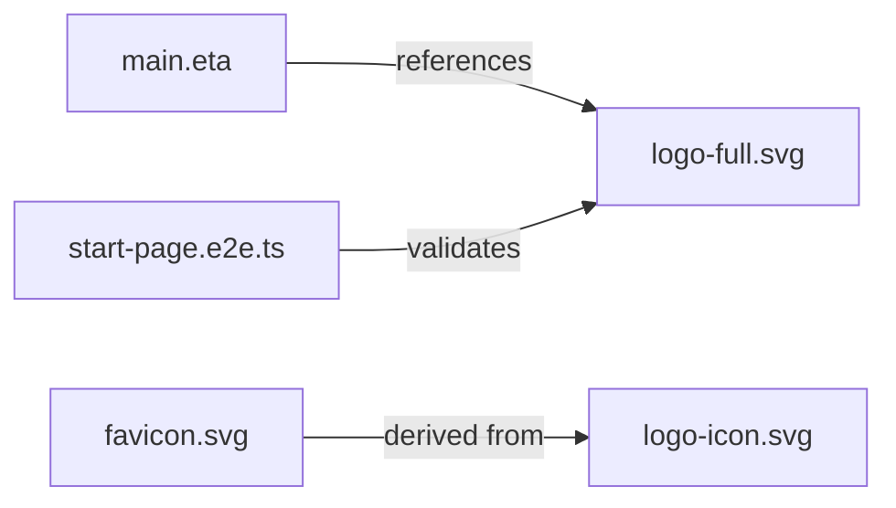

# Requirements

### Overview & Goals
The goal is to replace the current generic "galloping pony" logo with a unique, modern, and humorous brand identity that reflects the core purpose of **PostPony**: postponement.

### Functional Requirements

- **Humorous Concept**: A "Snoozing Pony" leaning against an alarm clock, lazily pressing the snooze button.
- **Modern Aesthetic**: Simple silhouettes, bold colors (`#1a237e`), and clean lines.
- **Production Ready**: Optimized SVGs with proper accessibility attributes.
- **Variants**: Full logo (with text), icon-only (for small contexts), and monochrome.

### Out of Scope

- Redesigning the entire UI color scheme (we will stick to the existing Indigo/Navy palette).
- Adding animations to the logo (keeping it simple for now).

# Technical Design

### Current Implementation

- The current logo is `src/public/assets/logo.svg`.
- It is a 248x64 SVG with a galloping pony and text.
- Integrated via `` tag in `main.eta`.

### Proposed Design
The new logo will feature:

1. **Icon Component**: A rounded-rect or circular base containing a relaxed pony silhouette.
2. **Postponement Symbol**: An alarm clock with a prominent snooze button being "tapped" by the pony's hoof.
3. **Typography**: "PostPony" wordmark using a sans-serif font stack (Segoe UI/Roboto), with "Post" and "Pony" differentiated by color weights.

### File Structure

```text
src/public/assets/logos/
├── logo-full.svg        # Standard version with text
├── logo-icon.svg        # Icon only (for favicons/small UI)
└── logo-monochrome.svg  # Single color version
```

### Key Decisions

- **SVG over PNG**: Keeping the logo as SVG ensures perfect scaling and minimal file size.
- **Internalizing Text**: The wordmark will be part of the SVG to ensure consistent font rendering across platforms without requiring external font loading for the logo.
- **Accessibility**: Use `<title>` and `<desc>` tags within the SVG, and `role="img"` with `aria-label` on the root element.

### Architecture Diagram



# Testing

### Validation Approach

- **Visual Inspection**: Use the browser to verify the logo renders correctly at various zoom levels.
- **A11y Check**: Run `checkA11y()` in e2e tests to ensure the new SVG doesn't introduce violations.
- **E2E Tests**: Verify the logo link works and the image source is correct.

### Key Scenarios

- Logo links to homepage.
- Icon is visible in browser tabs (favicon).
- Logo maintains legibility at 40px height.

# Delivery Steps

### Step 1: Set up logo directory structure
A new directory `src/public/assets/logos` is created to store the different variants of the logo.

- Create the directory.
- Define the naming convention for variants (e.g., `logo-full.svg`, `logo-icon.svg`, `logo-monochrome.svg`).

### Step 2: Generate SVG logo variants
Three SVG variants are created featuring a "sleeping pony with an alarm clock" concept.

- `logo-full.svg`: Combined pony silhouette, alarm clock with snooze bar, and "PostPony" wordmark.
- `logo-icon.svg`: The pony and clock symbol without text, optimized for small sizes (favicons).
- `logo-monochrome.svg`: A single-color version of the icon for use on colored backgrounds.
- All SVGs will be hand-crafted for minimal file size and accessibility (ARIA roles and labels).

### Step 3: Integrate new logo into the app and tests
The application is updated to use the new "funny" logo as the primary brand asset.

- Update `src/routes/layouts/main.eta` to point to the new logo path.
- Update `src/public/assets/favicon.svg` to match the new icon design.
- Update `e2e-tests/start-page.e2e.ts` to verify the new logo file path and presence.

### Step 4: Provide SVG icon generator guidance
Provide a README or documentation section on how to generate different icon sizes and formats from the master SVGs.

- Document use of tools like `svgo` for optimization.
- Provide a sample command for generating PNG/ICO if ever needed (ponytail: current implementation uses raw SVG for simplicity).
