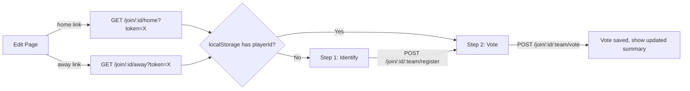

# Requirements

### Overview & Goals

Implement the player onboarding and voting flow for proposed reschedule dates. Invited players from both teams visit a team-specific invitation link, identify themselves, and vote on proposed dates.

### Scope

**In Scope:**

- Two invitation links on the edit page (home team, away team) replacing the current single link
- Join page: step 1 — player identification (pick existing name or enter new)
- Join page: step 2 — voting on proposed dates (Yes/No/Maybe per date)
- Self-registration (entering a new name adds the player to the respective team)
- Changing votes until the admin finalizes
- Vote summary visible to voters

**Out of Scope:**

- Authentication/impersonation prevention (per user decision)
- Admin voting on behalf of players
- Approval/finalization workflow (separate future task)
- Opponent captain role distinctions

### User Stories

1. As a **home team player**, I receive a home-team invitation link so I can join the rescheduling process.
2. As an **away team player**, I receive an away-team invitation link so I can join the rescheduling process.
3. As an **invited player**, I can select my name from existing players or enter a new name so I am identified.
4. As an **invited player**, I can vote Yes/No/Maybe on each proposed date so my preferences are recorded.
5. As an **invited player**, I can change my votes on subsequent visits so I can update my preferences.
6. As the **admin**, I see two separate invitation links (home/away) on the edit page so I can share the right link with each team.

### Functional Requirements

- The edit page shows two links: `/join/<id>/home?token=<invitationPassword>` and `/join/<id>/away?token=<invitationPassword>`
- The join page step 1 shows a list of existing players for that team (radio buttons) plus an input to add a new name
- Selecting an existing name or entering a new name proceeds to step 2
- Entering a new name creates a `Player` record for the respective team
- Step 2 shows all proposed dates with Yes/No/Maybe vote buttons per date
- Multiple votes (one per proposed date) are submitted together
- If a player revisits, their previous votes are pre-selected
- Player identification is stored in the browser's `localStorage`, keyed by postponement ID (e.g. key `postpony-player-<sessionId>`, value is the `playerId`). A different postponement may yield a different player ID for the same person.
- Voting is disabled (read-only) when session status is `Confirmed`

# Technical Design

### Current Implementation

- **Model** (`src/lib/models.ts`): `RescheduleSession` has `invitationPasswordHash`, `players: Player[]`, `proposedDates: ProposedDate[]`. `Vote` interface exists but is unused. `Player.teamId` is currently a plain `string` (hardcoded to `'home-team'` in `players-post.ts`).
- **Edit page** (`src/routes/edit/id/edit.eta`): Shows single invite link `/join/<id>` (no token in URL, no `/join/` route exists).
- **Session creation** (`src/routes/create/create-post.ts`, `src/routes/create/scrape/meeting-post.ts`): Generates `invitationPassword` and stores hash. Scrape flow captures `homeTeam`/`guestTeam` in `metadata.meeting`.
- **In-memory storage**: Sessions stored in `App.sessions` (static `Record<string, RescheduleSession>`).
- **Test fixtures** (`src/lib/__test-utils__/builders.ts`): Deep-merge partial builders `aPlayer`, `aProposedDate`, `aVote`, `aVenue`, `aSession` already exist. The existing `edit-handlers.spec.ts` uses them to construct sessions and inject them via `app.sessions[session.id] = session`. This is the established unit-test convention for route-handler tests.

### Key Decisions

1. **Single invitation token, team role in URL path**: Keep the existing single `invitationPasswordHash`. The URL encodes the team: `/join/:id/home?token=X` vs `/join/:id/away?token=X`. Simpler model, no extra password fields.
2. **Player identification via localStorage**: Store `{ playerId }` in `localStorage` keyed by session ID (e.g. `postpony-player-<sessionId>`). On return visits, the join page reads the stored playerId client-side and auto-skips to the voting step. Different postponements get independent player identities. No cookies needed.
3. **Votes stored on session**: Add `votes: Vote[]` to `RescheduleSession` for MVP simplicity (in-memory store). No sub-collections needed yet.
4. **Team role as literal type**: Use `'home' | 'away'` for `teamId` on `Player` and derive from URL path.
5. **Reuse fixture builders for all new tests**: The join-handler unit tests reuse `aSession`, `aPlayer`, `aProposedDate`, and `aVote` from `src/lib/__test-utils__/builders.ts` instead of hand-building model objects. Because this task changes the model, the builders themselves must be updated in lockstep so they remain the single source of truth for valid fixtures.

### Proposed Changes

#### Model changes (`src/lib/models.ts`)

- Add `votes: Vote[]` to `RescheduleSession`
- Change `Player.teamId` type to `'home' | 'away'`
- Add `invitationPassword: string` (unhashed) to `RescheduleSession` so the edit page can embed it in links

#### Fixture builder changes (`src/lib/__test-utils__/builders.ts`, `builders.spec.ts`)

The builders currently encode the **old** model and will no longer compile/represent a fully-populated entity after the model changes. They must be updated:

- `aPlayer`: change default `teamId` from `'home-team'` to `'home'` (now a `'home' | 'away'` literal).
- `aSession`: add `votes: []` and `invitationPassword: 'invitation-pw'` to the default so it still returns a session with **every required field** (the invariant asserted by `builders.spec.ts`).
- `builders.spec.ts`: update the equality assertions for `aPlayer()` (teamId) and `aSession()` (new `votes`/`invitationPassword` fields).

Keeping the builders correct means every new join test — and the existing `edit-handlers.spec.ts` — gets the new fields for free without hand-editing model literals.

#### Edit page changes (`src/routes/edit/id/edit.eta`, `edit-id-get.ts`)

- Replace single invite link with two links (home/away), each including `?token=<invitationPassword>`
- Pass `invitationPassword` to the template from the session (now stored unhashed on `RescheduleSession`)

#### New join routes (`src/routes/join/`)

- `router.ts` — mounts under `/join`
- `join-get.ts` — GET `/:id/:team` — validates token, renders the join page. Client-side JS reads `localStorage` for an existing `playerId` and skips to step 2 if found.
- `join.eta` — step 1 template (player list + new name input)
- `join-register-post.ts` — POST `/:id/:team/register` — creates or selects player, returns `playerId` in response so the client stores it in `localStorage`, then shows voting step
- `vote.eta` — step 2 template (proposed dates with vote buttons)
- `join-vote-post.ts` — POST `/:id/:team/vote` — saves/updates votes for the player

#### Localization (`src/locales/en.json`, `src/locales/de.json`)

- Add keys: `invite_link_home_label`, `invite_link_away_label`, `join_title`, `join_select_player`, `join_new_player`, `join_continue`, `vote_title`, `vote_yes`, `vote_no`, `vote_maybe`, `vote_submit`, `vote_updated`, `vote_summary`

#### Wire up (`src/index.ts`)

- Import and mount `joinRouter` at `/join`

### File Structure

```
src/routes/join/           (new directory)
  ├── router.ts
  ├── join-get.ts
  ├── join.eta
  ├── join-register-post.ts
  ├── vote.eta
  └── join-vote-post.ts
src/routes/edit/id/edit.eta       (modified — two invite links)
src/routes/edit/id/edit-id-get.ts (modified — pass invitation password)
src/lib/models.ts                 (modified — votes array, teamId type, invitationPassword field)
src/lib/__test-utils__/builders.ts      (modified — teamId 'home', votes, invitationPassword)
src/lib/__test-utils__/builders.spec.ts (modified — updated default-shape assertions)
src/locales/en.json               (modified — new keys)
src/locales/de.json               (modified — new keys)
src/index.ts                      (modified — mount join router)
```

### Architecture Diagram



### Risks

- **Fixture drift**: If `builders.ts` is not updated alongside the model, `builders.spec.ts` and `edit-handlers.spec.ts` will fail to compile or assert. Updating the builders is part of Step 1, before any consumer changes.

# Testing

### Validation Approach

- Unit tests for new route handlers (join-get, register, vote), placed alongside source files as `*.spec.ts`
- **Reuse the fixture builders** from `src/lib/__test-utils__/builders.ts` (`aSession`, `aPlayer`, `aProposedDate`, `aVote`) to construct test data, following the existing `edit-handlers.spec.ts` pattern (inject via `app.sessions[session.id] = session`). Prefer partial overrides (e.g. `aPlayer({ teamId: 'away' })`, `aSession({ proposedDates: [aProposedDate()], votes: [aVote()] })`) over hand-built literals.
- Update `builders.spec.ts` to reflect the new default shapes (`teamId: 'home'`, `votes`, `invitationPassword`).
- Lint check via `npm run lint`
- Browser verification of the join flow via Chrome DevTools MCP

### Key Scenarios

1. **Token validation**: GET `/join/:id/home` without token → error; with wrong token → error; with correct token → success
2. **Player registration**: POST new name → player added to session with correct team (`aSession()` as the seed); POST existing name (seed with `aSession({ players: [aPlayer()] })`) → selects existing player
3. **Voting**: POST votes for all proposed dates (seed with `aSession({ proposedDates: [aProposedDate()] })`) → votes stored; revisit → votes pre-selected (seed existing `aVote()`); change and resubmit → votes updated
4. **Edit page**: Two invitation links displayed with correct URLs including token
5. **localStorage flow**: After registration, `playerId` is stored in `localStorage` under a session-specific key; revisiting the same postponement skips to vote step; a different postponement starts fresh

### Edge Cases

- Session not found → 404
- Invalid team parameter (not 'home' or 'away') → 400
- No proposed dates yet → show message, no vote form
- Session status is 'Confirmed' → votes are read-only (seed with `aSession({ status: 'Confirmed' })`)
- Player name already exists on team → select existing instead of duplicate

### Test Changes

- Update `src/lib/__test-utils__/builders.ts` defaults and `builders.spec.ts` assertions for the new model.
- Add join-handler specs that consume the updated builders.

# Delivery Steps

### Step 1: Step 1: Model changes, fixture builders, and edit page invitation links
The model supports votes and typed teams, the shared fixture builders match the new model, and the edit page shows two team-specific invitation links.

- Add `votes: Vote[]` to `RescheduleSession` in `src/lib/models.ts`
- Add `invitationPassword: string` (unhashed) to `RescheduleSession` so the edit page can embed it in links
- Change `Player.teamId` type to `'home' | 'away'`
- Update `src/lib/__test-utils__/builders.ts`: change `aPlayer` default `teamId` to `'home'`, and add `votes: []` and `invitationPassword: 'invitation-pw'` to the `aSession` default so it stays fully populated
- Update `src/lib/__test-utils__/builders.spec.ts` equality assertions to match the new `aPlayer`/`aSession` default shapes
- Update `src/routes/create/create-post.ts` and `src/routes/create/scrape/meeting-post.ts` to store `invitationPassword` and initialize `votes: []`
- Update `src/routes/edit/id/edit-id-get.ts` to pass `invitationPassword` to the template
- Update `src/routes/edit/id/edit.eta` to show two links (home/away) with `?token=<invitationPassword>`
- Add localization keys `invite_link_home_label` and `invite_link_away_label` to `en.json` and `de.json`
- Update `players-post.ts` to use `'home'` instead of `'home-team'` for `teamId`
- Fix `edit-handlers.spec.ts` and any other existing tests affected by the model change (assertions now expect `teamId: 'home'`)

### Step 2: Step 2: Join page step 1 — player identification and registration
Invited players can visit a team-specific link, identify themselves by picking an existing name or entering a new one.

- Create `src/routes/join/router.ts` mounting GET `/:id/:team` and POST `/:id/:team/register`
- Create `src/routes/join/join-get.ts`: validate token query param against session's `invitationPasswordHash`, validate team param is `'home'|'away'`, always render step 1 (client-side JS checks `localStorage` and auto-redirects to vote step if a `playerId` exists)
- Create `src/routes/join/join.eta`: step 1 template with radio buttons listing existing players for the team, a text input for a new player name, and a continue button
- Create `src/routes/join/join-register-post.ts`: validate input, create new `Player` (if new name) or select existing, return `playerId` (client-side JS stores it in `localStorage` as `postpony-player-<sessionId>`), then render step 2
- Wire up `joinRouter` in `src/index.ts` at `/join`
- Add localization keys: `join_title`, `join_select_player`, `join_new_player`, `join_continue`, `join_or_new`
- Add `join-get`/`join-register-post` unit specs that build sessions with `aSession`, `aPlayer` (e.g. `aPlayer({ teamId: 'away' })`) and inject them via `app.sessions[...]`, covering token validation and both new/existing player paths

### Step 3: Step 3: Join page step 2 — voting on proposed dates
Identified players can vote Yes/No/Maybe on each proposed date and change their votes.

- Create `src/routes/join/vote.eta`: template showing each proposed date with Yes/No/Maybe radio buttons, pre-selected from existing votes, a submit button, and a vote summary table
- Create `src/routes/join/join-vote-post.ts`: parse votes from the form, upsert into `session.votes` for the player, re-render the vote step with the updated summary
- Add a GET `/:id/:team/vote?playerId=X` route (in `join-get.ts` or a dedicated handler) to render the vote template when `playerId` is supplied (sent by client-side JS after reading `localStorage`)
- Show a read-only view when session status is `Confirmed`
- Show a message when no proposed dates exist yet
- Add localization keys: `vote_title`, `vote_yes`, `vote_no`, `vote_maybe`, `vote_submit`, `vote_updated`, `vote_no_dates`, `vote_summary`
- Add `join-vote-post` unit specs using `aSession({ proposedDates: [aProposedDate()] })`, `aVote()`, and `aSession({ status: 'Confirmed' })` to cover vote submission, vote updating, and the read-only state
- Verify the full flow in the browser using Chrome DevTools MCP
