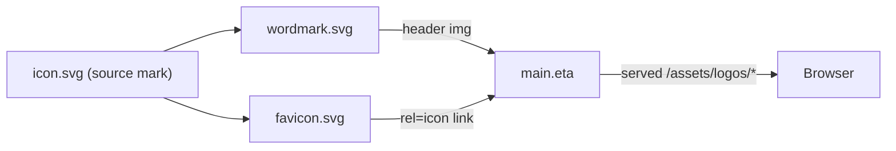

# Requirements

### Overview & Goals
Design a new, simple, modern brand mark for **PostPony** and ship it as production-ready SVG variants in `src/public/assets/logos`. The concept is a **pony peeking over a calendar** whose date is moving forward (a friendly visual pun for *postponing* a match), rendered in the existing indigo brand color with one **playful accent** color to make the joke pop.

The result replaces the current placeholder logo (a generic galloping-pony silhouette) and is wired into the app header and browser tab.

### Scope

#### In Scope

- A single reusable **icon/mark** (rounded indigo square: calendar + pony head peeking over + forward-moving date arrow in the accent color).
- A **horizontal wordmark** variant (icon + "PostPony" text), replacing the header logo.
- A small-size-optimized **favicon** variant, replacing the browser-tab icon.
- Indigo base (`#1a237e` / `#3949ab`) + one warm **accent** color for the arrow/highlight.
- A short **SVG generation & validation guide** (step-by-step) describing how the variants were produced and how to add/regenerate them.
- Wiring the new variants into `src/routes/layouts/main.eta` and updating the affected E2E tests.

#### Out of Scope

- Monochrome / dark-background variants (not requested).
- PWA web app manifest, maskable icons, or Apple touch icons.
- Any change to the app-wide `--primary` theme color or a full palette refresh.
- Raster (PNG/ICO) exports.

### User Stories

- As a **visitor**, I see a distinctive, friendly PostPony logo in the header that communicates "reschedule a game" at a glance.
- As a **user**, I recognize the app by its favicon in a crowded browser-tab bar.
- As a **maintainer**, I have a documented, repeatable way to regenerate or extend the logo variants.

### Functional Requirements

- The mark visually combines a **pony** and a **postponement symbol** (calendar with a forward date arrow), in a light-hearted way (pony peeking over the calendar).
- All three variants share the same icon artwork so the brand stays consistent.
- The header logo scales cleanly at 40px height; the favicon stays legible at 16–32px.
- Each SVG is accessible: `role="img"`, a `<title>` ("PostPony") and a `<desc>`, and is referenced with a meaningful `alt` in the header ``.

### Non-Functional Requirements

- **Accessibility (WCAG 2.2 AA):** accent-on-background and text color combinations meet contrast requirements; the start page keeps passing the Axe check.
- **Performance:** hand-optimized, dependency-free SVGs (small, no embedded rasters, minimal path data).
- **Consistency:** kebab-case filenames, 2-space indentation, colors aligned with the app theme.

# Technical Design

### Current Implementation

- Logos live under `src/public/assets/`, served statically via `serveStatic({root: publicDir})` in `src/index.ts` at `/assets/*`.
- `src/public/assets/logo.svg` — horizontal wordmark (`viewBox 0 0 248 64`), galloping-pony silhouette in an indigo rounded square + "PostPony" text (`#1a237e` / `#3949ab`).
- `src/public/assets/favicon.svg` — 32×32 icon-only version of the same silhouette.
- `src/routes/layouts/main.eta` references both: the favicon `<link rel="icon" … href="/assets/favicon.svg">` (line 8) and the header `` (line 28).
- `src/public/assets/logos/` already exists but is empty — the intended home for the new variants.
- `e2e-tests/start-page.e2e.ts` asserts the header logo (`img[src="/assets/logo.svg"]`) and favicon (`link[rel="icon"]` → `/assets/favicon.svg`) are present, served with `image/svg+xml`, and that the page has no Axe violations.
- App primary color is `--primary: #1a237e` (set in `main.eta`); the wordmark also uses `#3949ab`.

### Key Decisions

- **Single source-of-truth mark:** author the square **icon** first, then derive the wordmark (icon + text) and favicon (simplified icon) from the exact same paths/colors. Rationale: guarantees visual consistency and keeps future edits in one place.
- **Concept = pony peeking over a calendar + forward date arrow.** Rationale: user-selected; the forward-moving date is a clear "postpone" signal and the peeking pony adds the funny brand personality.
- **Palette = indigo base + one accent.** Keep `#1a237e` (bg) and `#3949ab`, add a warm accent (proposed **amber `#ffb300`**) for the date arrow/highlight only. Rationale: keeps brand/theme consistency (and existing tests) while making the pun pop; amber-on-indigo and amber-on-white both clear WCAG AA for graphical contrast.
- **Place variants in `src/public/assets/logos/` and repoint references; remove the old root `logo.svg`/`favicon.svg`.** Rationale: the task asks for variants in `logos/`; leaving duplicates invites drift (deletion over addition). Only `main.eta` and the E2E test reference the old files, and both are updated.
- **Dependency-free, hand-authored + optimized SVG.** Rationale: guidelines discourage new dependencies; a documented manual SVGO-style optimization pass is enough for three small files.

### Proposed Changes

1. **Create the icon mark** `src/public/assets/logos/icon.svg` (`viewBox 0 0 64 64`): indigo rounded square background; a white calendar (header band + page); a curved **amber forward arrow** across the date area; a pony head/ears peeking over the top edge of the calendar. Includes `role="img"`, `<title>`, `<desc>`.
2. **Create the wordmark** `src/public/assets/logos/wordmark.svg` (`viewBox 0 0 248 64`): the icon on the left + `Post` (`#1a237e`) / `Pony` (`#3949ab`) text, mirroring the current wordmark layout so the 40px header slot is unaffected.
3. **Create the favicon** `src/public/assets/logos/favicon.svg` (`viewBox 0 0 32 32`): a simplified icon (fewer path points, bolder arrow, larger pony silhouette) tuned for 16–32px legibility.
4. **Wire into the layout** (`src/routes/layouts/main.eta`): point the favicon `<link>` to `/assets/logos/favicon.svg` and the header `` to `/assets/logos/wordmark.svg`.
5. **Remove** the now-unused `src/public/assets/logo.svg` and `src/public/assets/favicon.svg`.
6. **Add a generation/validation guide** `src/public/assets/logos/README.md`: step-by-step instructions for producing an SVG icon (canvas/viewBox setup, layer order, color tokens, accessibility attributes, small-size simplification, optimization/validation checklist), plus how to regenerate/add variants.
7. **Update E2E + add a validation test** (see Testing tab).

### Data Models / Contracts
Each SVG follows this accessible skeleton:

```svg
<svg xmlns="http://www.w3.org/2000/svg" viewBox="0 0 64 64" role="img" aria-label="PostPony logo">
  <title>PostPony</title>
  <desc>A pony peeking over a calendar whose date arrow moves forward.</desc>
  <!-- indigo rounded square, white calendar, amber forward arrow, pony head -->
</svg>
```

Color tokens used across variants:

- Background indigo `#1a237e`; secondary indigo `#3949ab`; white `#ffffff`; accent amber `#ffb300`.

### File Structure

```
src/public/assets/
  logos/
    icon.svg        (new - square mark, source of truth)
    wordmark.svg    (new - header logo)
    favicon.svg     (new - tab icon)
    README.md       (new - SVG generation & validation guide)
  logo.svg          (removed)
  favicon.svg       (removed)
src/routes/layouts/main.eta          (modified - repoint icon + logo refs)
src/public/assets/logos/logos.spec.ts (new - SVG validation unit test)
e2e-tests/start-page.e2e.ts          (modified - new asset paths)
```

### Architecture Diagram



### Risks

- **Tiny-size legibility:** a detailed pony+calendar can turn to mush at 16px. Mitigation: dedicated simplified `favicon.svg` variant, verified visually.
- **Contrast of accent:** amber must stay distinguishable on indigo and white. Mitigation: pick a Material amber shade and confirm graphical contrast; keep the Axe check green.
- **Broken references after file removal:** Mitigation: repoint `main.eta` and update the E2E assertions in the same change; grep confirms no other references.

# Testing

### Validation Approach
Validate the new assets both as **files** (well-formed, accessible, served correctly) and **in the UI** (rendered in the header/tab, no accessibility regressions). Prefer running tests via the IntelliJ MCP.

### Key Scenarios

- **Static serving:** `GET /assets/logos/wordmark.svg` and `GET /assets/logos/favicon.svg` return `200` with `content-type: image/svg+xml`.
- **Header logo:** the banner shows a link labeled "PostPony home" containing `img[src="/assets/logos/wordmark.svg"]`, visible at 40px.
- **Favicon:** `link[rel="icon"]` points to `/assets/logos/favicon.svg`.
- **Accessibility:** the start page passes the Axe check (`checkA11y`) and landmark assertions remain green.

### Edge Cases

- Old paths (`/assets/logo.svg`, `/assets/favicon.svg`) are no longer referenced anywhere (grep check).
- Favicon remains legible/recognizable at 16–32px (visual check via Browser MCP at `https://game-scheduler.localhost:3000`).

### Test Changes

- **Update** `e2e-tests/start-page.e2e.ts`: change the logo and favicon path assertions to the new `/assets/logos/…` URLs (keep the `image/svg+xml` and status checks).
- **Add** `src/public/assets/logos/logos.spec.ts` (Vitest): read each of the three SVGs, assert they parse as XML and each contains `role="img"` and a `<title>PostPony</title>` — the single runnable check that fails if a variant is malformed or loses its accessibility metadata.
- Verify UI rendering with the Browser MCP after wiring.

# Delivery Steps

###    * Step 1: Design the source icon mark (pony + calendar)
A production-ready square SVG mark exists at `src/public/assets/logos/icon.svg` combining a pony peeking over a forward-scrolling calendar.

- Author `icon.svg` with `viewBox 0 0 64 64`: indigo (`#1a237e`) rounded square, white calendar (header band + page), and a pony head/ears peeking over the calendar's top edge.
- Add the postponement cue: a curved **amber `#ffb300`** forward date arrow across the calendar face.
- Include accessibility metadata: `role="img"`, `<title>PostPony</title>`, and a descriptive `<desc>`.
- Keep paths minimal/optimized (no embedded rasters), 2-space indentation, colors aligned with the app theme.

### Step 2: Derive the wordmark and favicon variants
Two consistent variants derived from the source mark exist in `src/public/assets/logos`.

- Create `wordmark.svg` (`viewBox 0 0 248 64`): the icon plus `Post` (`#1a237e`) / `Pony` (`#3949ab`) text, matching the current header layout and 40px height slot.
- Create `favicon.svg` (`viewBox 0 0 32 32`): a simplified version of the mark (fewer points, bolder arrow, larger pony) tuned for 16–32px legibility.
- Reuse the exact color tokens and accessibility skeleton from `icon.svg` so all three stay visually consistent.

### Step 3: Wire variants into the layout and clean up old assets
The app header and browser tab use the new logos, and stale duplicates are gone.

- Update `src/routes/layouts/main.eta`: point the header `` to `/assets/logos/wordmark.svg` and the favicon `<link rel="icon">` to `/assets/logos/favicon.svg`.
- Remove the now-unused `src/public/assets/logo.svg` and `src/public/assets/favicon.svg`.
- Grep to confirm no remaining references to the old paths.

### Step 4: Add the SVG generation guide and validation tests
The variants are documented and covered by an automated check; the UI is verified.

- Add `src/public/assets/logos/README.md`: a step-by-step SVG icon generation guide (viewBox/canvas setup, layer order, color tokens, accessibility attributes, small-size simplification, optimization + validation checklist) and how to regenerate/add variants.
- Add `src/public/assets/logos/logos.spec.ts` (Vitest): assert each SVG parses as XML and contains `role="img"` and `<title>PostPony</title>`.
- Update `e2e-tests/start-page.e2e.ts` logo/favicon assertions to the new `/assets/logos/…` paths (keep status + `image/svg+xml` checks and the Axe check).
- Verify the header logo and favicon render correctly (incl. small-size legibility) via the Browser MCP at `https://game-scheduler.localhost:3000`.
