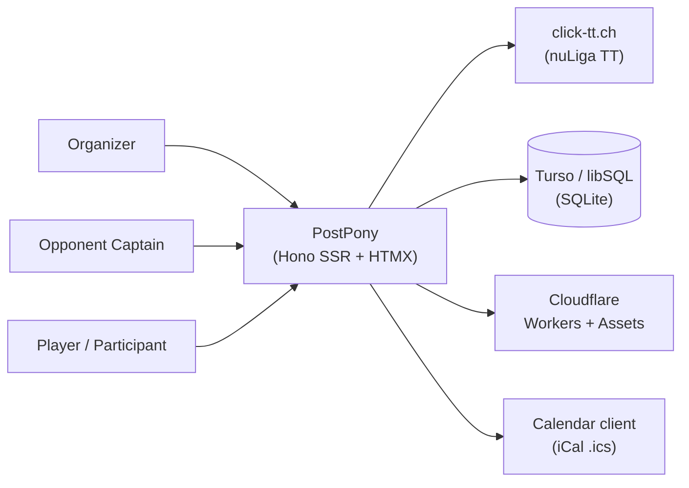

# 3. Context and Scope

## 3.1 Business Context

## 3.2 Technical Context — external interfaces

| External system                 | Purpose                                                                     | Interface                                                                                  | Code                                   |
|---------------------------------|-----------------------------------------------------------------------------|--------------------------------------------------------------------------------------------|----------------------------------------|
| **click-tt.ch**                 | scrape leagues, groups, teams, matches, rosters, club venues, home meetings | HTTPS GET + HTML parse (`node-html-parser`), `User-Agent: PostPony/1.0 (game rescheduler)` | `src/lib/click-tt-scraper.ts`          |
| **Turso / libSQL**              | durable session persistence (JSON blob)                                     | `@libsql/client` (node) / `@libsql/client/web` (Worker)                                    | `src/lib/session-store.ts`             |
| **Cloudflare Workers + Assets** | production compute + static assets, edge TLS                                | `worker.ts` `fetch` handler; `env.ASSETS.fetch` 404 fallback                               | `worker.ts`, `wrangler.jsonc`          |
| **Calendar clients**            | iCal subscription/download                                                  | `text/calendar` RFC 5545                                                                   | `src/lib/ical.ts`                      |
| **Browser storage**             | clipboard (copy links) + per-postponement identity                          | client JS, `localStorage`                                                                  | `src/public/assets/js/ui.js`, ADR-0013 |

click-tt URL surface (`src/lib/click-tt-scraper.ts`): leagues → groups → teams → matches/roster → club id → venues → club home meetings. When `click-tt-fixtures-dir` is set, `fetchHtml` reads local HTML instead of the network (offline fixture mode; e2e always runs in this mode).

## 3.3 Inbound interfaces

- HTTP (S) HTML/HTMX endpoints (route table in §5.3), plus two `text/calendar` endpoints.
- Static assets served by Node `serveStatic('/assets/*')` in dev and Workers Assets in prod.
- Node entry terminates its own TLS by default (`APP_TLS_ENABLED=true`); plain HTTP mode for reverse-proxy/Cloudflare edge TLS.

## 3.4 Users and roles (no accounts, no login)

| Role                     | Access                                                    | Mechanism                                                                                                        |
|--------------------------|-----------------------------------------------------------|------------------------------------------------------------------------------------------------------------------|
| **Organizer**            | creates + manages one postponement (full edit)            | organizer-captain password, verified on edit GET/POST (ADR-0025)                                                 |
| **Opponent Captain**     | own team only: roster, veto, mark acceptable              | opponent-captain password, verified on `/opponent/:id`                                                            |
| **Player / Participant** | joins + votes on their team only                          | per-team player password `?token=<home/awayPlayerPassword>`; identity in `localStorage` per postponement per team |

The Club Manager role from earlier planning is not implemented (see §1.1.1).

## 3.5 Scope

In scope: single-club postponement of a click-tt match from `Draft` through `Voting` to `Confirmed`, with clash detection, voting and iCal export.

Out of scope: multi-tenancy, club/venue management, player availability entry, participant-side proposals, message templates, two-step approval.
