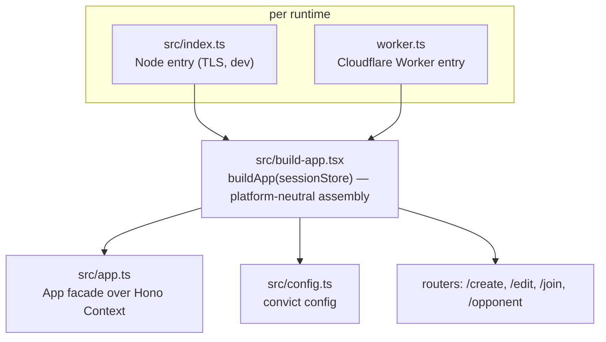

# 5. Building Block View

## 5.1 Level 1 — entry points and assembly

| File                    | Responsibility                                                                                                                                                           |
|-------------------------|--------------------------------------------------------------------------------------------------------------------------------------------------------------------------|
| `src/index.ts`          | Node entry: `loadDotEnv()`, ensure `./data` dir, construct + `migrate()` store, `buildApp(store)`, mount `serveStatic('/assets/*')`, start HTTP/HTTPS, graceful shutdown |
| `src/build-app.tsx`     | platform-neutral assembly: language middleware, store injection, `.spec.` asset blocker, route mounting, global `onError`                                                |
| `worker.ts`             | Cloudflare Worker entry: `applyWorkerEnv`, memoized store+app, `env.ASSETS.fetch` 404 fallback                                                                           |
| `src/worker-runtime.ts` | `process`/`process.env` shim so convict loads on Workers                                                                                                                 |
| `src/app.ts`            | `App` façade over Hono `Context`: `isPartial` (`HX-Request`), `store`, `locale`, `t()`, `render()`, `requireParam()`, throw helpers `notFound()/internal()/failure()`    |
| `src/config.ts`         | convict schema + strict validation; Node-only `loadDotEnv()`                                                                                                             |

## 5.2 Level 2 — `src/lib/` (domain + infrastructure)

| Module                        | Responsibility                                                                                                                                                                                                                 |
|-------------------------------|--------------------------------------------------------------------------------------------------------------------------------------------------------------------------------------------------------------------------------|
| `models.ts`                   | type core: `Team`, `PostponementStatus`, `ClickTtTeamIdentity`, `Player`, `Venue`, `Postponement`, `ProposedDate`, `Vote`, `VoteTallyItem`, `MatchFormat`, `DEFAULT_CLUB_ID`, `DEFAULT_MATCH_FORMAT`                           |
| `postponement.ts`             | `PostponementRules` pure domain ops (incl. `availabilityRanking`) + `newId()/now()` seam                                                                                                                                       |
| `session-store.ts`            | `SessionStore` interface, `normalize()` read-time upgrade, `MemorySessionStore`, `SqliteSessionStore`                                                                                                                          |
| `click-tt-scraper.ts`         | all scraping + HTML parsing + fixture seam                                                                                                                                                                                     |
| `clashes.ts`                  | clash domain (pure): `±2h` buffer, `computeClashes`, auto-deselect, `mergeOwnSideClashes` (single-side merge, never touches `votable`)                                                                                         |
| `clash-check.ts`              | shared schedule-check routines: `computeClashesForSession` (both teams + occupancy, edit paths; returns `ClashCheckOutcome` — `ok` / `transient-failure` / `unchanged`) and `computeOwnSideCheck` (one side, opponent refresh) |
| `scrape-errors.ts`            | `transientScrapeErrorKey`: classifies a thrown scrape error as retryable (`ClickTTError` → upstream, `TypeError` → unreachable) or non-transient                                                                               |
| `venue-occupancy.ts`          | pure count of home-club home matches in the buffered window                                                                                                                                                                    |
| `venues.ts`                   | `defaultVenueNumber`, `resolveVenue`; the absent-number-means-venue-1 rule                                                                                                                                                     |
| `proposed-dates-generator.ts` | pure weekday-tuple generator (planning window = original + 4 weeks)                                                                                                                                                            |
| `generator-memory.ts`         | `generatorMemoryKey(session)`: derives the generator "slate memory" localStorage key from the organizer team's click-tt identity (side-independent), or `undefined` when the identity is absent (hand-entered match)               |
| `ical.ts`                     | RFC 5545 builder (one VEVENT per votable date, per-date vote links)                                                                                                                                                            |
| `temporal-utils.ts`           | locale-aware Temporal parse/format; strict ISO round-trips                                                                                                                                                                     |
| `crypto-utils.ts`             | PBKDF2-SHA256 hashing, constant-time compare, id/password generation                                                                                                                                                           |
| `errors.ts`                   | `AppError(400)`, `InternalError(500)`, `StateError(404)`, `ClickTTError`                                                                                                                                                       |
| `map-validation-to-errors.ts` | Valibot result → `{fields, global}`                                                                                                                                                                                            |
| `hono-factory.ts`             | `factory`, `handleAppRequest` adapter Context→`App`                                                                                                                                                                            |
| `crawl-policy.ts`             | sole source of the crawl policy: `robots.txt`/`ai.txt` text, bot user-agent detection, allowed-path classifier (drives the bot filter + `X-Robots-Tag`)                                                                        |
| `logger.ts`                   | `AppLogger` façade; console always, pino on Node                                                                                                                                                                               |
| `middleware/language.ts`      | `?lang=` → cookie → `Accept-Language` → default locale resolution                                                                                                                                                              |

## 5.3 Routers and routes

Routers mounted in `src/build-app.tsx`: `/create`, `/edit`, `/join`, `/opponent`.

| Method | Path                                 | Handler                                                        |
|--------|--------------------------------------|----------------------------------------------------------------|
| GET    | `/`                                  | `handleIndexGet`                                               |
| GET    | `/robots.txt`                        | `handleRobotsTxt` (crawl policy, see §8.10)                    |
| GET    | `/ai.txt`                            | `handleAiTxt` (AI-agent policy mirror, see §8.10)              |
| GET    | `/create/scrape`                     | `handleScrapeLeaguesGet`                                       |
| GET    | `/create/scrape/groups`              | `handleScrapeGroupsGet`                                        |
| GET    | `/create/scrape/teams`               | `handleScrapeTeamsGet`                                         |
| GET    | `/create/scrape/matches`             | `handleScrapeMatchesGet`                                       |
| POST   | `/create/scrape/match`               | `handleScrapeMatchPost`                                        |
| GET    | `/edit/:id`                          | `handleEditGet`                                                |
| GET    | `/edit/:id/calendar.ics`             | `handleEditIcalGet`                                            |
| POST   | `/edit/:id/players`                  | `handleEditPlayersPost`                                        |
| POST   | `/edit/:id/proposed-dates`           | `handleEditProposedDatesPost`                                  |
| POST   | `/edit/:id/proposed-date-visibility` | `handleProposedDateVisibilityPost`                             |
| POST   | `/edit/:id/proposed-date-confirm`    | `handleConfirmDatePost`                                        |
| POST   | `/edit/:id/proposed-date-delete`     | `handleProposedDateDeletePost`                                 |
| POST   | `/edit/:id/refresh-clashes`          | `handleRefreshClashesPost`                                     |
| POST   | `/edit/:id/reopen`                   | `handleReopenPost`                                             |
| GET    | `/join/:id/:team`                    | `handleJoinGet`                                                |
| GET    | `/join/:id/:team/calendar.ics`       | `handleJoinIcalGet`                                            |
| GET    | `/join/:id/:team/vote`               | `handleJoinVoteGet`                                            |
| POST   | `/join/:id/:team/register`           | `handleJoinRegisterPost`                                       |
| POST   | `/join/:id/:team/vote`               | `handleJoinVotePost`                                           |
| GET    | `/opponent/:id`                      | `handleOpponentGet` (opponent-captain password gated)          |
| POST   | `/opponent/:id/players`              | `handleOpponentPlayersPost` (add/remove own team)              |
| POST   | `/opponent/:id/votable`              | `handleOpponentVotablePost` (own-side Votable toggle)          |
| POST   | `/opponent/:id/accepted`             | `handleOpponentAcceptedPost`                                   |
| POST   | `/opponent/:id/refresh-clashes`      | `handleOpponentRefreshPost` (own-side-only re-check, ADR-0026) |
| —      | `/assets/*`                          | `serveStatic` (Node) / Workers Assets; `.spec.` paths blocked  |

## 5.4 View components and partials

Layout: `src/routes/layouts/main.tsx` (`Layout`, `PartialLayout`, `pageLayout(view, content, title?)` branching on `view.isPartial`). Pages under `src/routes/{index,error}.tsx`, `create/scrape/*.tsx`, `edit/id/*.tsx`, `join/*.tsx`. Shared partials in `src/routes/partials/` — including the single `VenueChip` (`src/routes/partials/venues.tsx`) used by the edit date list and both vote polls to render "(1) Turnhalle orange" (short-name preferred, full name visually hidden). Every vote choice on the join poll — each per-date radio and the three "set all" buttons — carries a tooltip (`role="tooltip"` referenced by `aria-describedby`, revealed on hover and keyboard focus) explaining what Yes / No / If-necessary means. The vote form also posts natively without JavaScript: a `<noscript>`-wrapped `type="submit"` button renders only for scriptless browsers, so the htmx auto-save and the native form POST can never both fire. The scrape wizard's transient-failure shell is `src/routes/create/scrape/scrape-step-error.tsx` (`ScrapeStepError` + `renderScrapeStepError`), rendered in place of a step by the scrape handlers. Edit view data is assembled in `src/routes/edit/id/render-edit-partials.tsx` and
mutations run through the single `runEditCommand` pipeline in `run-edit-command.ts`. Opponent view data is assembled in `src/routes/opponent/render-opponent.tsx` (`buildOpponentViewData` carries only the opponent side's clash lines) and mutations
run through `runOpponentCommand` in `run-opponent-command.ts`. Both builders read the organizing/opponent team's ranked bands from `PostponementRules.availabilityRanking`; `sort-control.tsx` turns those bands into labelled rail groups via `groupByAvailabilityBands`/`availabilityGroupLabel` (Full strength / With if-necessary / Reduced strength / Not playable, ADR-0027). The role-instructions partial `src/routes/partials/workflow-instructions.tsx` (`WorkflowInstructions`, `OrganizerWorkflowInstructions`) renders the collapsible "How it works" block on the organizer edit page and the opponent page — a step list that condenses to a closing note once the session is `Confirmed`; its open/closed state persists in localStorage via `initPersistedDetails` (`src/public/assets/js/ui.js`), and confirm/reopen swaps re-ship the block out-of-band (`renderWorkflowInstructions` flag in `runEditCommand`). The generator form (`GenerateForm`) emits a `data-generator-memory-key` attribute derived from the organizer team's click-tt identity; `initGeneratorMemory` (`ui.js`) captures the typed weekday times and venue into a locale-canonical `localStorage` slate on every generator submit (including failed validation) and prefills empty rows + the venue on load and after each `htmx:afterSettle`, so the slate prefill never overwrites a server-echoed validation value.
