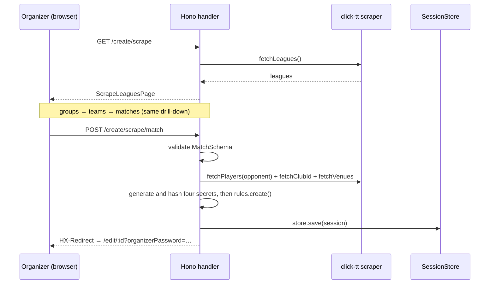
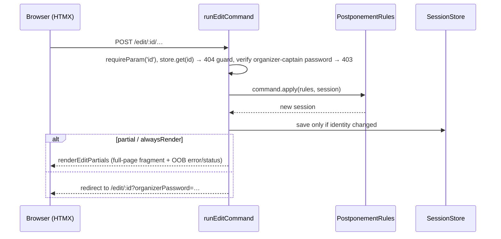
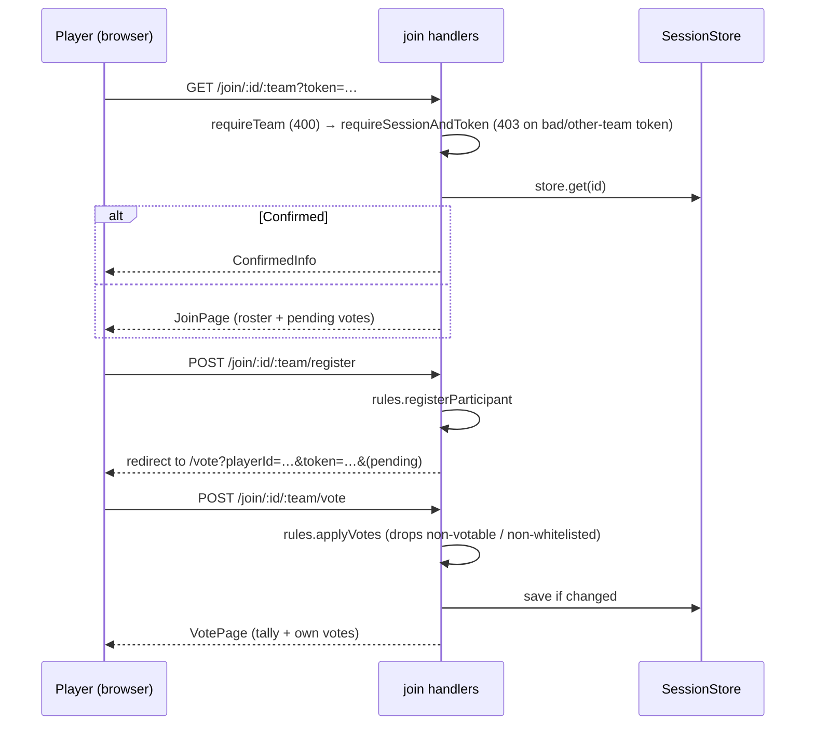
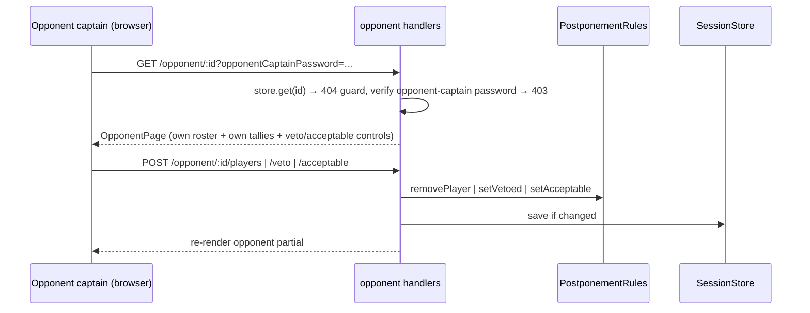

# 6. Runtime View

## 6.1 Create a postponement (scrape wizard)

Four GETs drill league → group → team → match. The final POST captures both teams' click-tt identities (ADR-0022), generates and hashes the four per-postponement secrets (organizer-captain, opponent-captain, home-player, away-player; ADR-0025), creates a `Draft` postponement, saves it, and redirects to the edit view (the plaintext organizer-captain password is shown once). The three shareable plaintexts (opponent-captain, home-player, away-player) are persisted so the edit page can render share links.

## 6.2 Edit mutations — single pipeline

All seven edit POSTs (`players`, `proposed-dates`, `proposed-date-visibility`, `proposed-date-confirm`, `proposed-date-delete`, `refresh-clashes`, `reopen`) flow through `runEditCommand(app, command)`:

The organizer-captain password is verified on every edit GET and POST (`edit-auth.ts`); it travels as `?organizerPassword=` and is threaded through every HTMX request URL the edit page renders. `confirmDate` succeeds only for a date that is votable, acceptable, and not vetoed — otherwise it is a no-op and the handler announces a "not acceptable" message.

Proposing dates branches on `generate === 'tuple'` (single date vs generator). Both paths end in `withClashCheck`, which scrapes both teams' schedules and the home club's meetings, computes clashes + venue occupancy, and auto-deselects newly-added clashing dates (ADR-0023). A failed scrape degrades silently: dates are saved clash-free.

## 6.3 Join and vote

A documented deliberate **state-changing GET** (`GET /join/:id/:team/vote`) applies votes read from `?vote-<dateId>` query params, so one-click calendar vote links work (`join-vote-get.ts`). Player identity is stored in `localStorage` key `postpony-player-<sessionId>-<team>`. The join token is the matching team's player password (home path → home-player password, away path → away-player password); a team/token mismatch is a 403.

## 6.4 Opponent captain (scoped)

The opponent captain is the side opposite `organizerTeam`, identified only by holding the opponent-captain password. The surface is scoped to their own team: add/remove players (removal cascade-deletes votes), veto votable dates (`setVetoed` no-ops on non-votable), and mark dates acceptable. No propose, `votable`-toggle, or confirm affordance exists here, and the organizer's team tallies are never rendered. Each date row shows only the opponent side's clash lines (or the clean chip when checked-clean) under a four-part date cell; the organizer side's lines never reach the template.

The opponent re-check (`POST /opponent/:id/refresh-clashes`) flows through the same `runOpponentCommand` pipeline: it scrapes only the opponent side's schedule (`computeOwnSideCheck`), merges the fresh lines over the shared snapshot with `mergeOwnSideClashes` (organizer lines preserved, `votable` untouched), and replaces Venue Occupancy only when the home side's re-fetch succeeds (ADR-0026). A failed check saves nothing — previous snapshot plus warning, or the plain nothing state. The status announcement renders outside `#opponent-view` so the HTMX swap target never destroys it.

## 6.5 iCal export

`GET /edit/:id/calendar.ics` (no password) and `GET /join/:id/:team/calendar.ics` (token-gated) both build an RFC 5545 calendar — one `VEVENT` per votable date, `STATUS:CONFIRMED` only when locked, `TZID=Europe/Zurich`, plus per-date one-click vote links in `X-ALT-DESC`.

## 6.6 Locale resolution (every request)

`languageMiddleware` runs for `*`: `?lang=<locale>` sets a 365-day cookie and redirects with `lang` stripped; otherwise cookie → `Accept-Language` (q-sorted, prefix-mapped) → default `de-CH`.

## 6.7 Error path

Any thrown error reaches the central `onError` in `src/build-app.tsx`: `ClickTTError` → 400 + translated message; `AppError`/`HTTPException` → own status; anything else → 500. Partial requests render an out-of-band `<ErrorContainer>` swapped into `#error-container`; full requests render `<ErrorPage>`.
