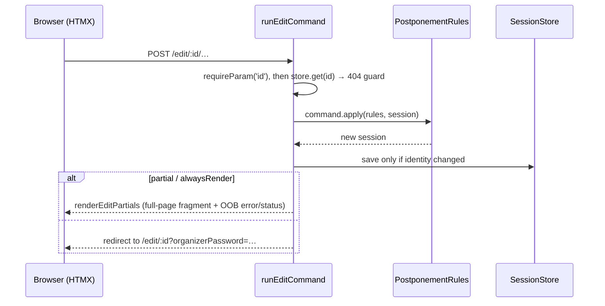
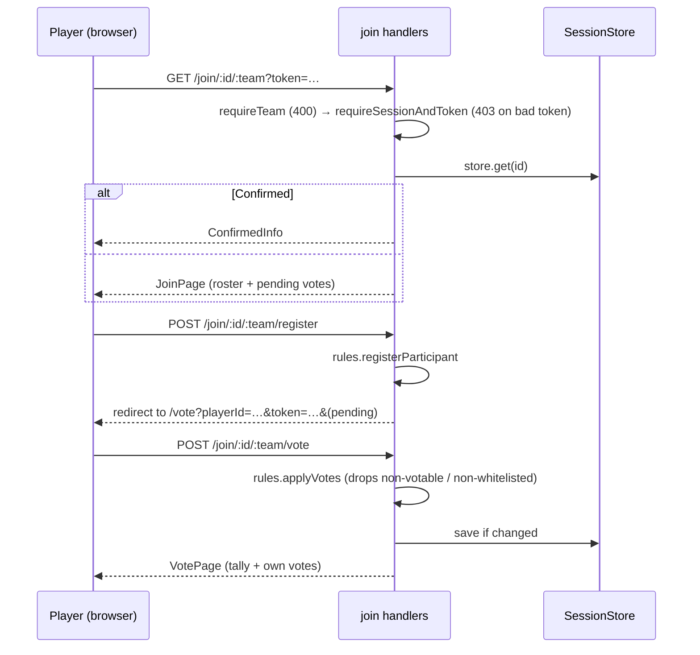

# 6. Runtime View

## 6.1 Create a postponement (scrape wizard)

Four GETs drill league → group → team → match. The final POST captures both teams' click-tt identities (ADR-0022), generates and hashes both passwords, creates a `Draft` postponement, saves it, and redirects to the edit view (the plaintext organizer password is shown once).

## 6.2 Edit mutations — single pipeline

All seven edit POSTs (`players`, `proposed-dates`, `proposed-date-visibility`, `proposed-date-confirm`, `proposed-date-delete`, `refresh-clashes`, `reopen`) flow through `runEditCommand(app, command)`:

Proposing dates branches on `generate === 'tuple'` (single date vs generator). Both paths end in `withClashCheck`, which scrapes both teams' schedules and the home club's meetings, computes clashes + venue occupancy, and auto-deselects newly-added clashing dates (ADR-0023). A failed scrape degrades silently: dates are saved clash-free.

## 6.3 Join and vote

A documented deliberate **state-changing GET** (`GET /join/:id/:team/vote`) applies votes read from `?vote-<dateId>` query params, so one-click calendar vote links work (`join-vote-get.ts`). Player identity is stored in `localStorage` key `postpony-player-<sessionId>-<team>`.

## 6.4 iCal export

`GET /edit/:id/calendar.ics` (no password) and `GET /join/:id/:team/calendar.ics` (token-gated) both build an RFC 5545 calendar — one `VEVENT` per votable date, `STATUS:CONFIRMED` only when locked, `TZID=Europe/Zurich`, plus per-date one-click vote links in `X-ALT-DESC`.

## 6.5 Locale resolution (every request)

`languageMiddleware` runs for `*`: `?lang=<locale>` sets a 365-day cookie and redirects with `lang` stripped; otherwise cookie → `Accept-Language` (q-sorted, prefix-mapped) → default `de-CH`.

## 6.6 Error path

Any thrown error reaches the central `onError` in `src/build-app.tsx`: `ClickTTError` → 400 + translated message; `AppError`/`HTTPException` → own status; anything else → 500. Partial requests render an out-of-band `<ErrorContainer>` swapped into `#error-container`; full requests render `<ErrorPage>`.
