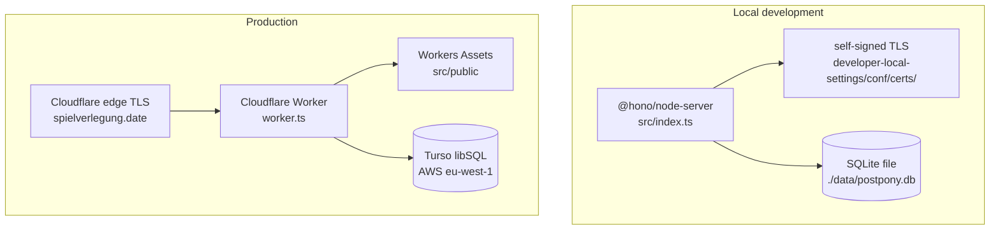

# 7. Deployment View

## 7.1 Node (development)

- `src/index.ts` loads `.env`, migrates the store, serves `/assets/*` from disk, and terminates its own TLS by default (`APP_TLS_ENABLED=true`).
- Certificates live at `developer-local-settings/conf/certs/<hostname>.pem|.key`, generated by `scripts/create-certs.sh` (requires `mkcert`). The default hostname is `game-scheduler.localhost`, URL `https://game-scheduler.localhost:3000`.
- Plain-HTTP mode (`APP_TLS_ENABLED=false`) is for running behind a reverse proxy or Cloudflare's edge TLS.

## 7.2 Cloudflare Workers (production)

- `wrangler.jsonc`: name `postpony`, `main: worker.ts`, `compatibility_date 2026-09-11`, custom domain route `spielverlegung.date`, Workers Assets directory `src/public` (binding `ASSETS`).
- `wrangler` is an npm `devDependency` (see `package.json`); `npm run worker:build` / `worker:deploy` resolve it via `node_modules/.bin`, so an `npm ci`/`npm install` is all that's needed to get it.
- Vars: `TURSO_DB_URL` (committed) + secret `TURSO_DB_AUTH_TOKEN` (via `wrangler secret put`, never committed). Turso region: AWS eu-west-1.
- `worker.ts` constructs a module-scope singleton app + store (lazily migrated) and bridges Worker bindings into `process.env` via `applyWorkerEnv`; a 404 falls back to `env.ASSETS.fetch(request)`.
- `src/worker-runtime.ts` fabricates `globalThis.process` so convict loads.
- Observability enabled, `head_sampling_rate: 1`.

## 7.3 Configuration surface (convict)

| Key                   | Env                         | Default                    |
|-----------------------|-----------------------------|----------------------------|
| env                   | `NODE_ENV`                  | development                |
| port                  | `APP_PORT`                  | 3000                       |
| hostname              | `APP_HOSTNAME`              | `game-scheduler.localhost` |
| base-url              | `APP_BASE_URL`              | `''`                       |
| use-fixtures          | `APP_USE_FIXTURES`          | false                      |
| click-tt-fixtures-dir | `APP_CLICK_TT_FIXTURES_DIR` | `''`                       |
| db-url                | `APP_DB_URL`                | `file:./data/postpony.db`  |
| db-auth-token         | `APP_DB_AUTH_TOKEN`         | `''`                       |
| tls-enabled           | `APP_TLS_ENABLED`           | true                       |

`config.validate({allowed:'strict'})` runs at import. `E2E_APP_PORT` (default 3001) and `CI` are read by Playwright, not convict.

## 7.4 Data layer

Single table `sessions (id TEXT PRIMARY KEY, club_id TEXT NOT NULL, data TEXT NOT NULL)`; the whole `Postponement` is stored as JSON. `get()` reads by `id` only (no `club_id` filter — single-tenant). `normalize()` back-fills legacy fields at read time. Migration runner: `npm run db:migrate` (`scripts/run-migration.ts`).

## 7.5 CI

**There is no CI.** `.github/workflows` does not exist. `npm run verify` (lint → test → build → e2e) is the manual gate, run locally. ADR-0010 (GitHub Actions) is superseded and was never implemented — see §11.
