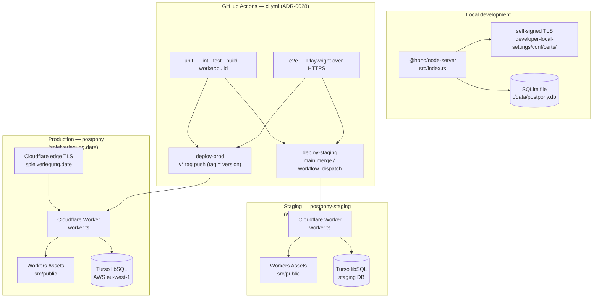

# 7. Deployment View

## 7.1 Node (development)

- `src/index.ts` loads `.env`, migrates the store, serves `/assets/*` from disk, and terminates its own TLS by default (`APP_TLS_ENABLED=true`).
- Certificates live at `developer-local-settings/conf/certs/<hostname>.pem|.key`, generated by `scripts/create-certs.sh` (requires `mkcert`). The default hostname is `game-scheduler.localhost`, URL `https://game-scheduler.localhost:3000`.
- Plain-HTTP mode (`APP_TLS_ENABLED=false`) is for running behind a reverse proxy or Cloudflare's edge TLS.

## 7.2 Cloudflare Workers (production and staging)

`wrangler.jsonc` holds both Workers — the top-level **`postpony`** production config and an **`env.staging`** block (name `postpony-staging`) — from one `worker.ts` and one asset directory. `wrangler` is an npm `devDependency` (see `package.json`); `npm run worker:build` / `worker:deploy` resolve it via `node_modules/.bin`, so an `npm ci`/`npm install` is all that's needed to get it.

- **Production (`postpony`)**: `main: worker.ts`, `compatibility_date 2026-09-11`, custom domain route `spielverlegung.date`, Workers Assets directory `src/public` (binding `ASSETS`). Vars: `TURSO_DB_URL` (committed) + secret `TURSO_DB_AUTH_TOKEN` (via `wrangler secret put`, never committed). Turso region: AWS eu-west-1.
- **Staging (`postpony-staging`)**: `env.staging` in `wrangler.jsonc`, workers.dev URL, no custom-domain route; `TURSO_DB_URL` is a committed var for the staging DB, the token stays a Worker secret (refreshed per deploy, §7.5). Single shared slot — last `main` merge or dispatch wins, no per-PR previews (ADR-0028). The closest automated proxy for the production shape: same Worker bundle, same lazy migration on first request.
- `worker.ts` constructs a module-scope singleton app + store (lazily migrated) and bridges Worker bindings into `process.env` via `applyWorkerEnv`; a 404 falls back to `env.ASSETS.fetch(request)`.
- `src/worker-runtime.ts` fabricates `globalThis.process` so convict loads.
- Observability enabled, `head_sampling_rate: 1`.

## 7.3 Configuration surface (convict)

| Key                   | Env                         | Default                    |
|-----------------------|-----------------------------|----------------------------|
| env                   | `NODE_ENV`                  | development                |
| port                  | `APP_PORT`                  | 3000                       |
| hostname              | `APP_HOSTNAME`              | `game-scheduler.localhost` |
| base-url              | `APP_BASE_URL`              | `''`                       |
| use-fixtures          | `APP_USE_FIXTURES`          | false                      |
| click-tt-fixtures-dir | `APP_CLICK_TT_FIXTURES_DIR` | `''`                       |
| db-url                | `APP_DB_URL`                | `file:./data/postpony.db`  |
| db-auth-token         | `APP_DB_AUTH_TOKEN`         | `''`                       |
| tls-enabled           | `APP_TLS_ENABLED`           | true                       |

`config.validate({allowed:'strict'})` runs at import. `E2E_APP_PORT` (default 3001) and `CI` are read by Playwright, not convict.

## 7.4 Data layer

Single table `sessions (id TEXT PRIMARY KEY, club_id TEXT NOT NULL, data TEXT NOT NULL)`; the whole `Postponement` is stored as JSON. `get()` reads by `id` only (no `club_id` filter — single-tenant). `normalize()` back-fills legacy fields at read time. Migration runner: `npm run db:migrate` (`scripts/run-migration.ts`).

## 7.5 CI

`ci.yml` (`.github/workflows/`, ADR-0028) runs the full Verify Gate on every push (any branch or tag), pull request, and `workflow_dispatch`, as two parallel jobs — `unit` and `e2e` are the required status checks on `main` (repo-admin step, ticket 01). Neither job uses secrets.

- **`unit`** (`ubuntu-latest`): `jdx/mise-action` installs the mise toolchain from `mise.toml` (Node 26, mkcert, turso), then `npm ci`, Playwright Chromium (for the vitest `browser` project), `npm run lint`, `npm run test` (unit + browser, 90 % per-file coverage), `npm run build`, and — as a separate step — `npm run worker:build` (wrangler `--dry-run` bundle validation, deliberately not part of `npm run verify`).
- **`e2e`**: same provisioning, plus `/etc/hosts` maps `game-scheduler.localhost` to loopback (RFC 6761 resolution is not guaranteed on the runner) and `scripts/create-certs.sh` regenerates the self-signed TLS cert (mkcert) before `npm run e2e`. The suite runs over HTTPS with the click-tt fixtures — the same shape as local development.

`npm run verify` (lint → test → build → e2e) remains the manual local gate; `npm run check:actionlint` runs `actionlint` over the workflow YAML but is deliberately not wired into `verify` or CI — the script is named `check:` instead of a `lint:actionlint` so the repo's `lint:*` run-all wildcard cannot auto-wire it into the gate. The workflow is validated by running it, not by linting it in the gate (ADR-0028).

- **`deploy-staging`** (needs `unit` + `e2e`, only `main` merges and `workflow_dispatch`): credentials from GitHub secrets — `CLOUDFLARE_API_TOKEN` + `CLOUDFLARE_ACCOUNT_ID` (account id treated as a secret, never committed to `wrangler.jsonc`). It dry-runs the staging bundle (`wrangler deploy --dry-run --env staging`), refreshes the staging Worker's `TURSO_DB_AUTH_TOKEN` secret from the GitHub secret (fail-loud if missing), then `npm run worker:deploy -- --env staging` → `postpony-staging`.
- **`deploy-prod`** (needs `unit` + `e2e`, only `v*` tag pushes): credentials from the same GitHub secrets as staging. The tag/version guard first refuses the deploy (exit non-zero, before any account operation) unless the pushed tag equals `v${npm_package_version}` at the tagged commit — belt-and-suspenders against the release script, which produces matching tag/manifest pairs from its side. On match it refreshes the production Worker's `TURSO_DB_AUTH_TOKEN` secret from the GitHub secret (fail-loud if missing) and runs `npm run worker:deploy` (no `--env` → the top-level `postpony` config, custom domain `spielverlegung.date`). No migration step: the worker migrates lazily on first request (§7.2).

## 7.6 Release script

`npm run release` (`scripts/release.mjs`) keeps the release tag and the `package.json` version in lock step. It fails loudly — before any git mutation — on a dirty working tree, an existing `vX.Y.Z` tag, or a version that is neither `X.Y.Z-dev` nor a plain `X.Y.Z` awaiting its first tag; then it runs the Verify Gate (`npm run verify`) and aborts the whole release if that fails; then it bumps `package.json` to the release `X.Y.Z`, commits, creates the annotated `vX.Y.Z` tag at that commit, bumps back to the next `X.Y.0-dev` and commits. It never pushes: it prints `git push` and `git push --tags` for the human, because pushing the tag is what triggers the `deploy-prod` job (§7.5). Purely local tooling, deliberately kept out of the vitest coverage include and not unit-tested (see ADR-0028).
